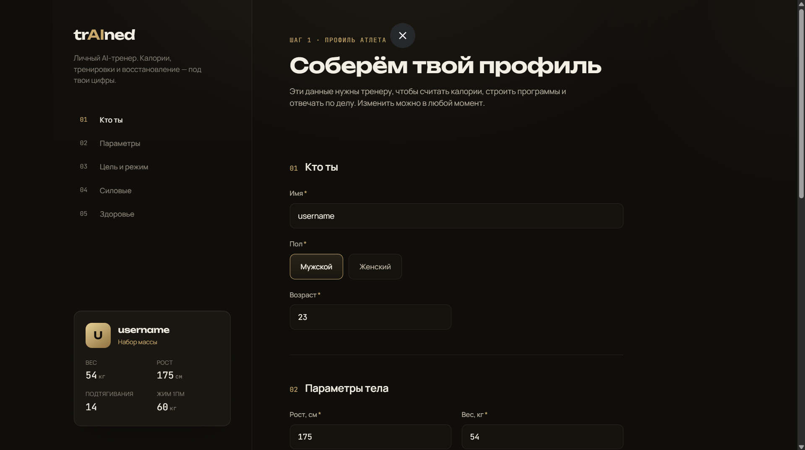
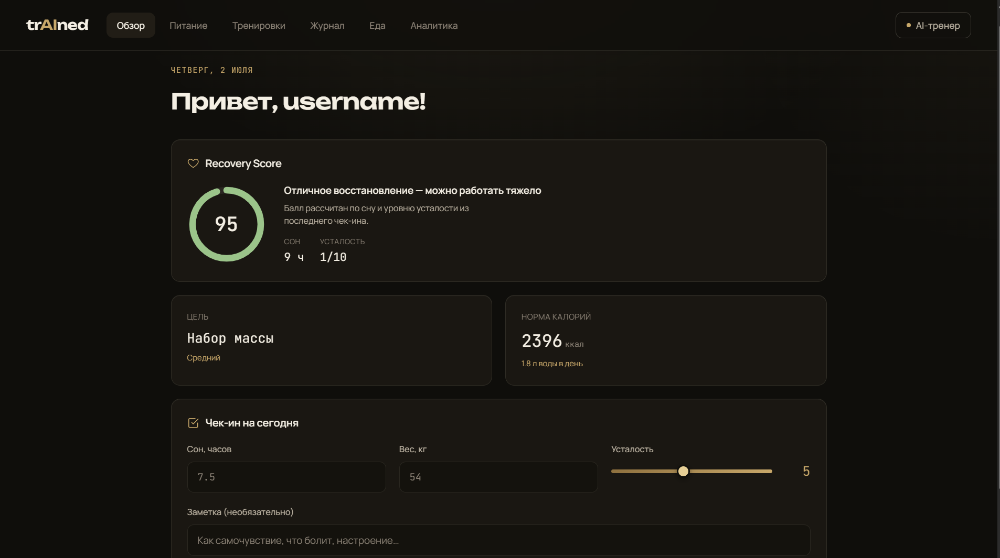
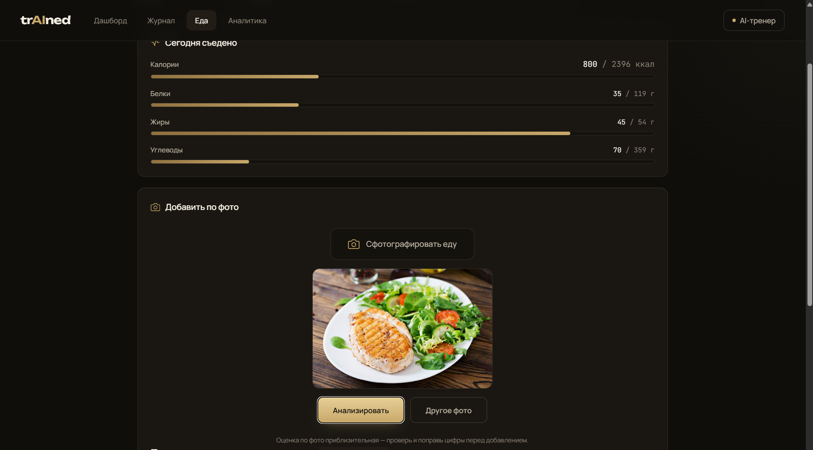
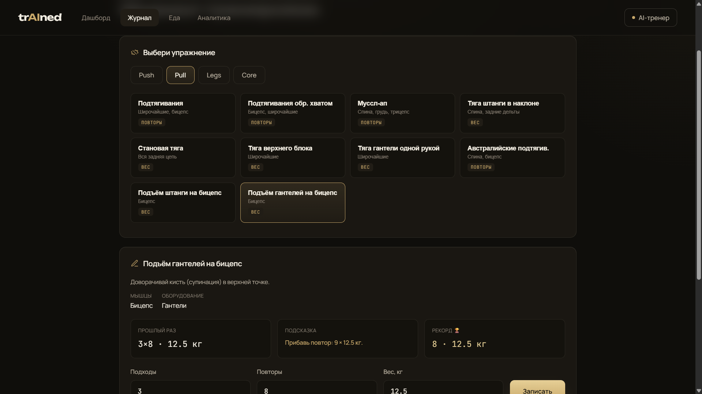
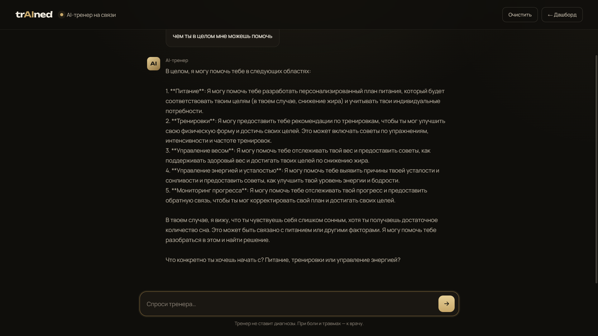
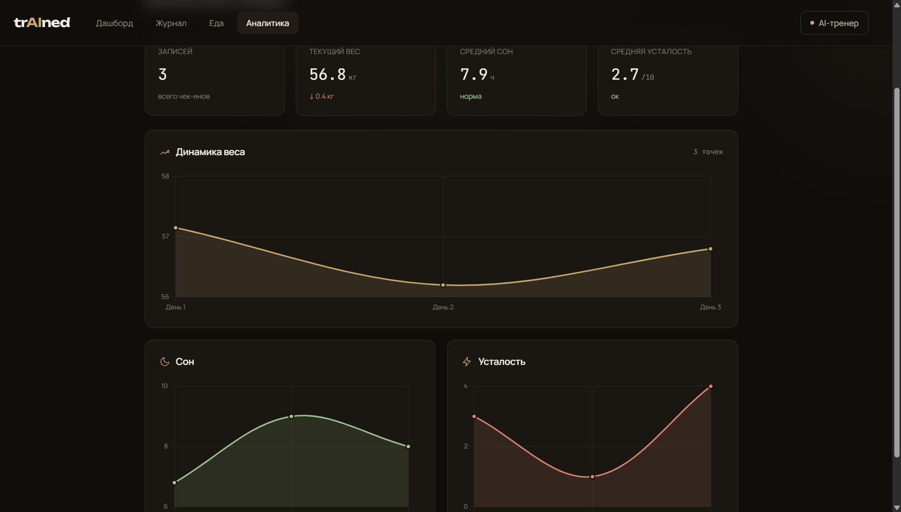
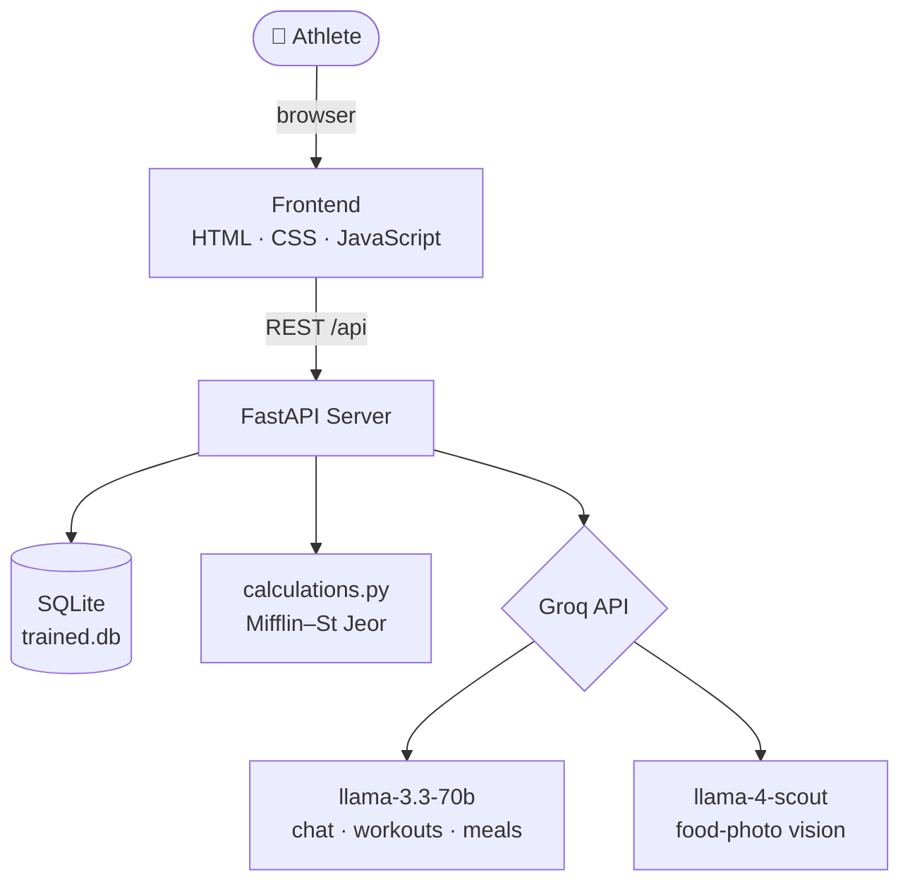

<div align="center">

# 🏋️ trAIned

### Your personal AI fitness & nutrition coach

Track your training, scan your meals, and get advice tuned to *your* numbers — powered by AI.


</div>

---

## 📖 About

**trAIned** is a full-stack web app that acts as a personal fitness coach for one athlete. It calculates your calorie and macro targets, generates workouts that adapt to how recovered you are, tracks your strength progress with progressive-overload suggestions, and — its standout feature — **estimates the calories and macros of a meal from a single photo**, including regional Central Asian dishes like beshbarmak, plov, and manty.

I built it as an athlete who wanted one tool that actually understood my own training data instead of generic advice.

---

## ✨ Features

| Module | What it does |
| --- | --- |
| **🧭 Onboarding** | Collects your profile: age, height, weight, goal, activity level, injuries, and strength stats. |
| **🍽️ Smart Nutrition** | Calculates daily calories & macros (Mifflin–St Jeor) and generates a full day's meal plan with AI. |
| **📸 Food Diary (photo & text)** | Snap a photo of your meal — a vision model estimates calories & macros — or simply describe it in words ("beshbarmak, large plate ~400 g"). Estimates are editable before saving, and daily intake is tracked against your targets. Recognizes local Central Asian dishes. |
| **💪 Smart Training** | AI workout generator that adapts to your sleep & fatigue, plus a library of **55 exercises** filterable by equipment (bodyweight / dumbbells / gym / bands) with difficulty levels, step-by-step technique guides & common mistakes, set logging, **progressive-overload suggestions**, and **personal records**. |
| **💬 AI Coach Chat** | Full-screen chat that knows your profile, latest check-in, weekly stats, and nutrition plan. Conversation history is persisted. |
| **🔋 Recovery Score** | A 0–100 readiness score derived from your sleep and fatigue check-ins. |
| **📊 Analytics** | Progress charts for body weight, sleep, and fatigue over time. |

---

## 🖼️ Screenshots

> Replace these with your own screenshots (see the [Screenshots](#-adding-screenshots) note below).

| Onboarding | Dashboard |
| --- | --- |
|  |  |

| Photo Food Diary | Workout Log |
| --- | --- |
|  |  |

| AI Coach | Analytics |
| --- | --- |
|  |  |

---

## 🏗️ Architecture

A lightweight, single-user app: a vanilla JS frontend talks to a FastAPI backend over a REST API. The backend handles the math itself, stores everything in SQLite, and calls the Groq API for anything that needs intelligence.



---

## 🛠️ Tech Stack

- **Backend:** Python, FastAPI, Uvicorn
- **Database:** SQLite
- **AI:** Groq API — `llama-3.3-70b-versatile` (text) and `meta-llama/llama-4-scout-17b-16e-instruct` (vision)
- **Frontend:** Vanilla HTML / CSS / JavaScript (no framework), Chart.js for graphs
- **Design:** Custom dark design system (shared `style.css`), Google Fonts (Unbounded, Manrope, JetBrains Mono)

---

## 📂 Project Structure

```
trAIned/
├── backend/
│   ├── __init__.py
│   ├── main.py            # FastAPI server: all endpoints + serves the frontend
│   ├── database.py        # SQLite connection & schema (5 tables)
│   ├── calculations.py    # Calorie & macro math (Mifflin–St Jeor)
│   ├── ai_coach.py        # Groq calls: chat, workout/meal generation, food-photo vision
│   └── exercises.py       # Exercise library (55 exercises: equipment, levels, technique) + progression logic
├── frontend/
│   ├── style.css          # Shared design system
│   ├── app.js             # Shared helpers (API wrappers, toast, labels)
│   ├── index.html         # Onboarding
│   ├── dashboard.html     # Dashboard (overview / nutrition / training)
│   ├── workout.html       # Workout log: equipment filter, technique guides, progression & PRs
│   ├── food.html          # Food diary (photo & text analysis)
│   ├── chat.html          # Full-screen AI coach
│   └── analytics.html     # Progress charts
├── docs/                  # Screenshots for this README
├── .env.example           # Template for your environment variables
├── .gitignore
├── requirements.txt
└── README.md
```

---

## 🚀 Getting Started

### Prerequisites

- Python 3.10 or newer
- A free [Groq API key](https://console.groq.com/keys)

### Installation

```bash
# 1. Clone the repository
git clone https://github.com/<your-username>/trAIned.git
cd trAIned

# 2. (Recommended) create a virtual environment
python -m venv venv
# Windows:
venv\Scripts\activate
# macOS / Linux:
source venv/bin/activate

# 3. Install dependencies
pip install -r requirements.txt

# 4. Add your Groq API key
#    Copy the example file and paste your key inside
cp .env.example .env          # Windows: copy .env.example .env
#    then edit .env -> GROQ_API_KEY=your_key_here

# 5. Run the server
uvicorn backend.main:app --reload
```

Open **http://127.0.0.1:8000** in your browser.

> **Windows note:** if `python` / `pip` / `uvicorn` aren't recognized, prefix them with the Python launcher:
> `py -m pip install -r requirements.txt` and `py -m uvicorn backend.main:app --reload`.

The SQLite database (`trained.db`) is created automatically on first run.

### Environment Variables

| Variable | Description |
| --- | --- |
| `GROQ_API_KEY` | Your Groq API key (required). Kept in `.env`, which is git-ignored. |

---

## 🔌 API Reference

Interactive docs are available at **`/docs`** (Swagger UI) once the server is running.

<details>
<summary><b>Profile</b></summary>

| Method | Endpoint | Description |
| --- | --- | --- |
| `POST` | `/api/profile` | Save the athlete profile, returns the computed nutrition plan |
| `GET` | `/api/profile` | Get the current profile |

</details>

<details>
<summary><b>Nutrition</b></summary>

| Method | Endpoint | Description |
| --- | --- | --- |
| `GET` | `/api/nutrition/plan` | Calorie & macro targets |
| `POST` | `/api/nutrition/meal-plan` | AI-generated meal plan |
| `POST` | `/api/nutrition/analyze-photo` | Estimate calories/macros from a food photo |
| `POST` | `/api/nutrition/analyze-text` | Estimate calories/macros from a text description |
| `GET` | `/api/nutrition/today` | Today's intake vs. target + meal list |
| `POST` | `/api/nutrition/log` | Add a meal to the diary |
| `DELETE` | `/api/nutrition/log/{id}` | Remove a meal |

</details>

<details>
<summary><b>Training</b></summary>

| Method | Endpoint | Description |
| --- | --- | --- |
| `POST` | `/api/training/workout` | AI workout for today |
| `POST` | `/api/training/log` | Daily check-in (sleep, fatigue, weight) |
| `GET` | `/api/training/logs` | Check-in history |
| `GET` | `/api/exercises` | Exercise library |
| `POST` | `/api/training/exercise-log` | Log a set; flags new personal records |
| `GET` | `/api/training/exercise-logs` | Logged sets history |
| `GET` | `/api/training/records` | Personal records per exercise |
| `GET` | `/api/training/progression/{exercise_id}` | Last set + overload suggestion |

</details>

<details>
<summary><b>Recovery & Chat</b></summary>

| Method | Endpoint | Description |
| --- | --- | --- |
| `GET` | `/api/recovery` | Recovery score (0–100) |
| `POST` | `/api/chat` | Ask the AI coach |
| `GET` | `/api/chat/history` | Chat history |
| `DELETE` | `/api/chat/history` | Clear chat |

</details>

---

## 🗄️ Database Schema

SQLite, five tables:

- **`profile`** — athlete data (single user)
- **`training_log`** — daily check-ins (sleep, fatigue, weight)
- **`nutrition_log`** — logged meals (calories, macros)
- **`workout_log`** — logged exercises (sets, reps, weight)
- **`chat_history`** — AI conversation history

---

## 🗺️ Roadmap

- [ ] Multi-user accounts (registration & login)
- [ ] Per-exercise progression charts
- [ ] Profile editing screen
- [ ] Training streaks & consistency tracking
- [ ] Body-measurement tracking (chest, arms, waist)
- [ ] Export progress to a PDF report
- [ ] Deploy to the web (mobile-friendly PWA)

---

## ⚠️ Disclaimer

trAIned is a personal project and **not** medical or professional dietary advice. Photo-based calorie estimates are approximate. Consult a qualified professional for medical, injury, or nutrition concerns.

---

## 📄 License

Released under the MIT License.

---

<div align="center">

Built with ❤️ and a lot of pull-ups.

</div>
